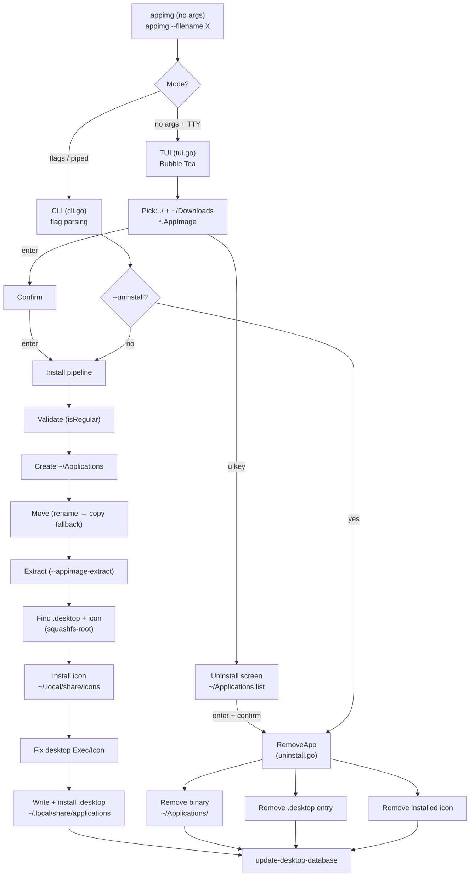

# appimg

Install an `.AppImage` like a native Linux app — moves it into `~/Applications`,
extracts its desktop entry + icon, and registers it on your system. Uninstalls cleanly too.

<p>
  
  
  
</p>

## Features

- **Clean uninstall** — removes the binary, `.desktop` entry, and icon
- **Cross-device safe** — falls back to copy when `~/Applications` lives on another filesystem

## Requirements

- Linux (any) 
- Go 1.26+ 
- Optional: `update-desktop-database` (refreshed automatically when present)

## Install

One-liner (builds from source, needs Go + git):

```sh
curl -fsSL https://raw.githubusercontent.com/Ashking-tech/AppImg/main/install.sh | bash
```

Custom directory:

```sh
curl -fsSL https://raw.githubusercontent.com/Ashking-tech/AppImg/main/install.sh | bash -s -- --dir /usr/local/bin
```

Or build manually:

```sh
git clone https://github.com/Ashking-tech/AppImg.git
cd AppImg
go build -o appimg .
```

## Usage

**Interactive TUI** (no args, in a terminal):

```sh
./appimg
```

> Up/Down navigate · / filter · enter select · **u** uninstall · q quit

**Install via CLI:**

```sh
./appimg --filename ~/Downloads/MyApp.AppImage
./appimg -f ~/Downloads/MyApp.AppImage
./appimg ~/Downloads/MyApp.AppImage
```

**Uninstall:**

```sh
./appimg --uninstall MyApp
./appimg -u MyApp
```

Non-interactive shells (pipes, scripts) get plain `[1/9] … ok` output instead of colors.

## Architecture



## Layout

| File          | What lives there                        |
|---------------|-----------------------------------------|
| `main.go`     | Core install pipeline + helpers         |
| `cli.go`      | Flag parsing, step output               |
| `tui.go`      | Boxed Bubble Tea interface              |
| `uninstall.go`| `RemoveApp` + target resolution         |

## Credits

- **Core pipeline** (`main.go`: validate → move → extract → desktop/icon handling) — **written by me**
- **TUI** (Bubble Tea picker, progress boxes, uninstall screen) — **built with AI assistance**
